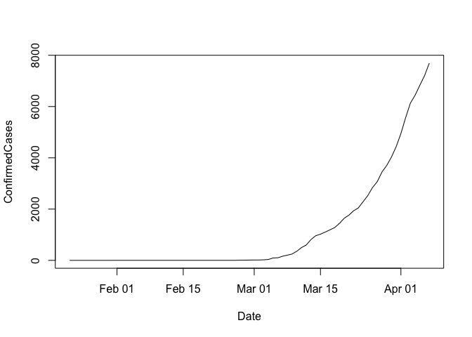
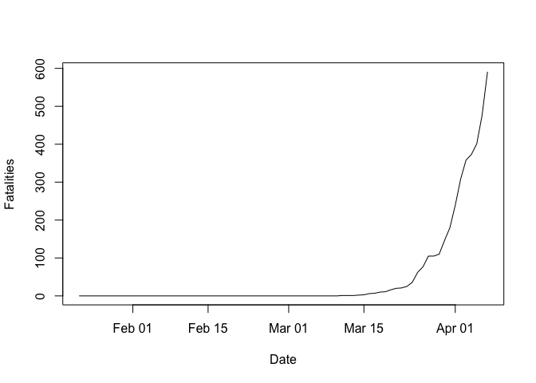
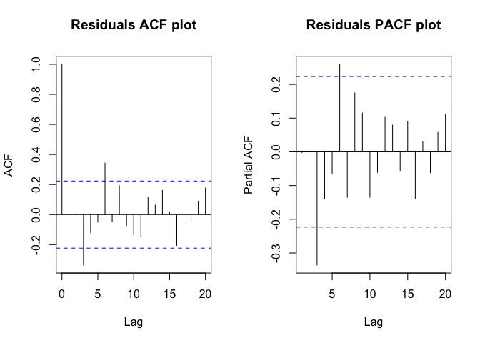
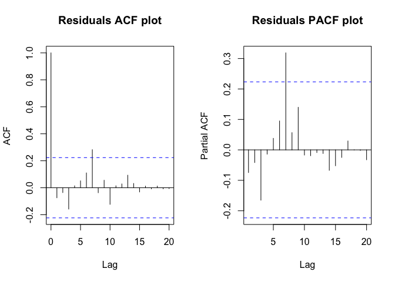
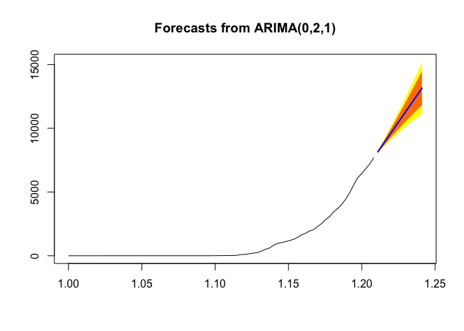
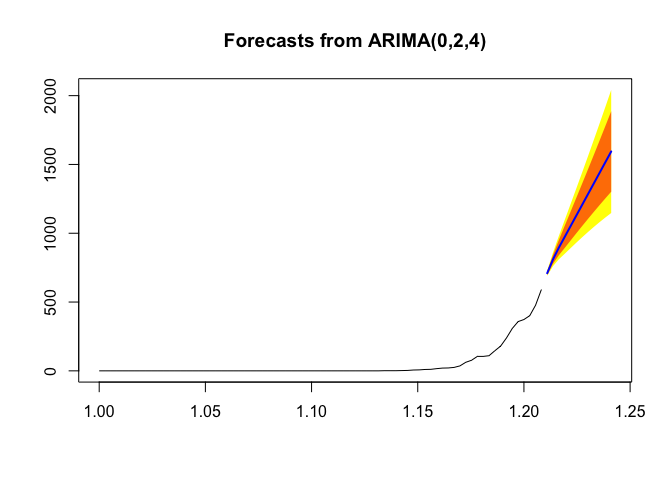

COVID-19 Global Forecasting (Kaggle Competition)
================

Strategy: My choice of algorithm is Time Series-ARIMA. I first checked
its effectiveness by building ARIMA models for 3-4 countries. I
concluded that its performance was very good. I then automated this
process and forecasted for all the given countries/states.

``` r
library(tseries)
library(forecast)
library(dplyr)

# Reading data
train<- read.csv('train.csv', stringsAsFactors= FALSE)
test<- read.csv('test.csv', stringsAsFactors= FALSE)

train$Date<- as.Date(train$Date)
test$Date<- as.Date(test$Date)
train$Id= NULL

head(train)
```

    ##   Province_State Country_Region       Date ConfirmedCases Fatalities
    ## 1                   Afghanistan 2020-01-22              0          0
    ## 2                   Afghanistan 2020-01-23              0          0
    ## 3                   Afghanistan 2020-01-24              0          0
    ## 4                   Afghanistan 2020-01-25              0          0
    ## 5                   Afghanistan 2020-01-26              0          0
    ## 6                   Afghanistan 2020-01-27              0          0

Some countries require forecasting for the whole while others such as
Austraila need forcasting for its states and not as a
    whole.

``` r
head(train[ train$Country_Region== 'Australia', ])
```

    ##                   Province_State Country_Region       Date ConfirmedCases
    ## 617 Australian Capital Territory      Australia 2020-01-22              0
    ## 618 Australian Capital Territory      Australia 2020-01-23              0
    ## 619 Australian Capital Territory      Australia 2020-01-24              0
    ## 620 Australian Capital Territory      Australia 2020-01-25              0
    ## 621 Australian Capital Territory      Australia 2020-01-26              0
    ## 622 Australian Capital Territory      Australia 2020-01-27              0
    ##     Fatalities
    ## 617          0
    ## 618          0
    ## 619          0
    ## 620          0
    ## 621          0
    ## 622          0

Taking Sweden as an example country to try ARIMA on.

``` r
sweden= train[ train$Country_Region== 'Sweden', ]

# Confirmed Cases in Sweden
with(sweden,plot(Date, ConfirmedCases , type= 'l'))
```

<!-- -->

``` r
# Fatalities in Sweden
with(sweden,plot(Date, Fatalities , type= 'l'))
```

<!-- -->

Since the count is cumulative, the trend is exponential in nature.

``` r
# ARIMA Model Building
#1. For Confirmed Cases
ts_cc<- ts(sweden$ConfirmedCases, frequency= 365)
ARIMA_cc<- auto.arima(ts_cc, approximation= F) 
ARIMA_cc
```

    ## Series: ts_cc 
    ## ARIMA(0,2,1) 
    ## 
    ## Coefficients:
    ##           ma1
    ##       -0.2990
    ## s.e.   0.1357
    ## 
    ## sigma^2 estimated as 3090:  log likelihood=-407.31
    ## AIC=818.61   AICc=818.78   BIC=823.25

``` r
#2. For Fatalities
ts_f<- ts(sweden$Fatalities, frequency= 365)
ARIMA_f<- auto.arima(ts_f, approximation= F) 
ARIMA_f
```

    ## Series: ts_f 
    ## ARIMA(0,2,4) 
    ## 
    ## Coefficients:
    ##          ma1      ma2      ma3      ma4
    ##       0.4252  -0.2218  -0.1186  -0.3753
    ## s.e.  0.1105   0.1262   0.1252   0.1082
    ## 
    ## sigma^2 estimated as 92.35:  log likelihood=-274.93
    ## AIC=559.86   AICc=560.73   BIC=571.45

Residual Analysis

1.  ACF & PACF

<!-- end list -->

``` r
# Confirmed cases
par(mfrow=c(1,2)) 
acf(as.numeric(ARIMA_cc$residuals) , lag.max = 20, main= "Residuals ACF plot") 
pacf(as.numeric(ARIMA_cc$residuals), lag.max = 20, main= "Residuals PACF plot")
```

<!-- -->

``` r
# Fatalities
par(mfrow=c(1,2)) 
acf(as.numeric(ARIMA_f$residuals), lag.max = 20, main= "Residuals ACF plot") 
pacf(as.numeric(ARIMA_f$residuals), lag.max = 20, main= "Residuals PACF plot")
```

<!-- -->

There is some valueable information persent at the 5th lag. Overall, it
is quite good with room for improvement.

Box-Ljung Test

``` r
# Confirmed Cases
Box.test(ARIMA_cc$residuals,lag= 20, type= "Ljung-Box")
```

    ## 
    ##  Box-Ljung test
    ## 
    ## data:  ARIMA_cc$residuals
    ## X-squared = 41.241, df = 20, p-value = 0.003468

``` r
# Fatalities
Box.test(ARIMA_f$residuals,lag= 20, type= "Ljung-Box")
```

    ## 
    ##  Box-Ljung test
    ## 
    ## data:  ARIMA_f$residuals
    ## X-squared = 13.732, df = 20, p-value = 0.8438

The probability that the residuals are random is quite high. Again,
there is room for improvement.

Forecasting

``` r
# Confirmed cases
forecast_cc <- forecast(ARIMA_cc, h= 12)
plot(forecast_cc, shadecols= "oldstyle")
```

<!-- -->

``` r
# Fatalities
forecast_f <- forecast(ARIMA_f, h= 12)
plot(forecast_f, shadecols= "oldstyle")
```

<!-- -->

Since the forecasting is for over 100 countries and is per state for
some countries, we automate this process.

``` r
# Solving empty values in 'province_state' column
train$Province_State<- ifelse(train$Province_State== "", paste("All", train$Country_Region ), train$Province_State)
test$Province_State<- ifelse(test$Province_State== "", paste("All", test$Country_Region ), test$Province_State)

# Creating submission df
submission<- data.frame(ForecastId=numeric(0), ConfirmedCases=numeric(0),Fatalities=numeric(0))

for (s in unique(test$Province_State)){

  # Gathering data
  trainState<- train[train$Province_State== s, ]
  testDates<- test[test$Province_State== s, 'Date' ]
  forecastStartDate<- last(trainState$Date) + 1
  forecastEndDate<- last(testDates)
  numberOfDaysToForecast<- as.numeric((forecastEndDate+1) - forecastStartDate)

  # Model building and forecasting
  # 1. Confirmed Cases
  tsObjConfirmedCases<- ts(trainState$ConfirmedCases, frequency = 365)
  arimaModelConfirmedCases<- auto.arima(tsObjConfirmedCases, ic='aic', approximation = F) 
  forecastConfirmedCases<- forecast(arimaModelConfirmedCases, h= numberOfDaysToForecast)
  # 2. Fatalities
  tsObjFatalities<- ts(trainState$Fatalities, frequency = 365)
  arimaModelFatalities<- auto.arima(tsObjFatalities, ic='aic', approximation = F) 
  forecastFatalities<- forecast(arimaModelFatalities, h= numberOfDaysToForecast)
  
  # Creating submission data
  predictionsTrainState<- data.frame(Date= trainState$Date , ConfirmedCases= fitted(arimaModelConfirmedCases), Fatalities= fitted(arimaModelFatalities)) 
  forecastTestState<- data.frame(Date= seq(forecastStartDate, forecastEndDate, by="days") , ConfirmedCases= forecastConfirmedCases$mean, Fatalities= forecastFatalities$mean) 
  allPredictionsAndForecasts<- bind_rows(predictionsTrainState, forecastTestState)
  requiredPredictionsAndForecasts<- allPredictionsAndForecasts[ (allPredictionsAndForecasts$Date >= first(testDates)) & (allPredictionsAndForecasts$Date<= last(testDates)), c('ConfirmedCases', 'Fatalities') ]
  requiredPredictionsAndForecasts<- data.frame(ForecastId= test[test$Province_State== s, 'ForecastId' ], requiredPredictionsAndForecasts) 
  
  # Add predictions to final submission file
  submission<- rbind(submission, requiredPredictionsAndForecasts)
}
```

``` r
head(submission)
```

    ##    ForecastId ConfirmedCases Fatalities
    ## 65          1       105.6509   2.468058
    ## 66          2       110.3086   5.045405
    ## 67          3       114.8511   4.651420
    ## 68          4       119.8920   4.405918
    ## 69          5       126.3607   4.252938
    ## 70          6       177.5621   4.157613
